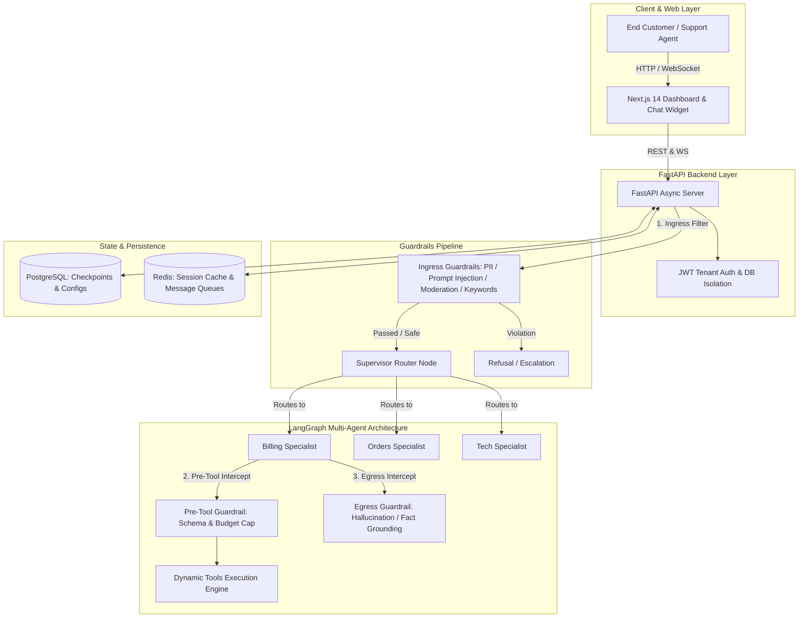
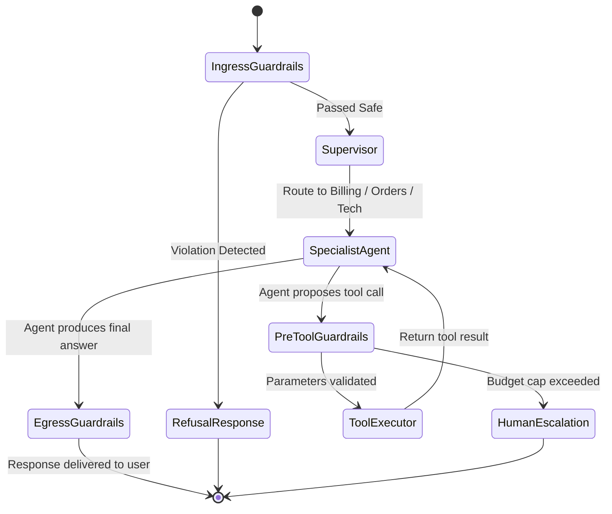

# Enterprise Multi-Agent AI Platform: Complete Learning Masterplan
> **A First-Principles, Step-by-Step Guide to Understanding the Architecture, LangGraph Orchestration, and Codebase**

---

## 🧭 Table of Contents
1. [Core Mental Model & First Principles](#1-core-mental-model--first-principles)
2. [High-Level Architecture Diagram](#2-high-level-architecture-diagram)
3. [Module 1: Database & Multi-Tenant Data Modeling](#3-module-1-database--multi-tenant-data-modeling)
4. [Module 2: The Agentic Heart (LangGraph & State Management)](#4-module-2-the-agentic-heart-langgraph--state-management)
5. [Module 3: Dynamic Tool Calling & Execution Engine](#5-module-3-dynamic-tool-calling--execution-engine)
6. [Module 4: The 11-Engine Enterprise Guardrails Pipeline](#6-module-4-the-11-engine-enterprise-guardrails-pipeline)
7. [Module 5: The FastAPI Backend & Live Streaming Layer](#7-module-5-the-fastapi-backend--live-streaming-layer)
8. [Module 6: The Next.js 14 Frontend & Policy Studio](#8-module-6-the-nextjs-14-frontend--policy-studio)
9. [Module 7: Hands-On Lab Experiments (Step-by-Step)](#9-module-7-hands-on-lab-experiments-step-by-step)
10. [Glossary of Key Concepts](#10-glossary-of-key-concepts)

---

## 1. Core Mental Model & First Principles

Before looking at any code, understand the **fundamental problem** this application solves:

### The Problem with Raw LLMs
A standard Large Language Model (like GPT-4) in isolation is:
* **Stateless**: It forgets everything between separate API calls unless conversation history is managed and persisted.
* **Disconnected from Private Data**: It has no knowledge of your company's order databases, policies, or users.
* **Unable to Take Actions**: It cannot issue a refund, create a support ticket, or check a shipment status without an external tool executor.
* **Prone to Safety Risks**: It can hallucinate facts, leak customer credit cards or PII, and be manipulated via adversarial prompt injections.

### The Enterprise Solution
Our application solves this by wrapping the LLM in an **Enterprise Agentic Architecture**:
1. **Memory & State Persistence**: PostgreSQL checkpointers store graph state after every single turn.
2. **Division of Labor**: A Supervisor router delegates complex incoming customer queries to specialist agents (Billing, Orders, Technical Support).
3. **Dynamic Tool Execution**: Validated execution engines allow agents to safely invoke private APIs and database actions.
4. **Defense in Depth**: A multi-stage 11-Engine Guardrail suite inspects user ingress, proposed tool calls, and assistant outputs.
5. **True Multi-Tenancy**: Data and policies are completely isolated per organization with cryptographic JWT authorization.

---

## 2. High-Level Architecture Diagram

---

## 3. Module 1: Database & Multi-Tenant Data Modeling

### First Principle
How do multiple distinct companies (tenants) share a single database infrastructure securely?
* Every record contains an `org_id` column.
* SQLAlchemy session queries strictly filter on `where(Model.org_id == user.org_id)`.

### Key Code References
* `server/app/db/models.py`:
  * `Organization` & `User`: Base tenancy and user authentication roles.
  * `Bot`: Customer-facing bot personality, greeting, and assigned guardrails.
  * `Agent`: Specialist sub-agents with custom system instructions, temperature, and assigned tool sets.
  * `Tool`: Dynamic tools, execution types (`api_call`, `python_code`, `system`), and JSON parameter schemas.
  * `Guardrail`: The 11-engine policy library with customizable JSON configurations and stages.
  * `Conversation` & `Message`: Full conversation transcripts and human escalation records.
* `server/scripts/seed.py`:
  * Default database seeder populating sample organizations, specialist agents, tools, and guardrails.

---

## 4. Module 2: The Agentic Heart (LangGraph & State Management)

### First Principle
What makes an "Agent" different from a standard LLM completion?
* An Agent operates in an **iterative loop**: `Observe State -> Reason -> Choose Action -> Execute Action -> Update State -> Final Response`.
* `LangGraph` models this loop as a stateful graph composed of **Nodes** (Python functions) and **Edges** (conditional routers).

### Key Code References
* `server/app/agent/state.py`:
  * `AgentState`: The shared dictionary passed across all nodes, holding `messages`, `current_agent`, `intermediate_steps`, and `guardrail_verdict`.
* `server/app/agent/graph.py`:
  * `supervisor_node()`: Triage agent that decides whether to route the conversation to Billing, Orders, Technical, or escalate to a human.
  * `specialist_agent_node()`: Dynamically loads the assigned agent prompt, binds allowed tools, and invokes the model.
  * `PostgresSaver` / checkpointer: Automatically snapshots full conversation graphs to PostgreSQL.

---

## 5. Module 3: Dynamic Tool Calling & Execution Engine

### First Principle
How does an AI model interact with external APIs safely?
* The LLM emits structured JSON (e.g. `{"name": "process_refund", "args": {"order_id": "ORD-1001", "amount": 50}}`).
* The application engine verifies the JSON against a strict JSON Schema before execution.

### Key Code References
* `server/app/agent/tools/orders.py`: Order status lookups, tracking, and cancellation tools.
* `server/app/agent/tools/payment.py`: Refund execution and invoice retrieval tools.
* `server/app/agent/tools/dynamic.py`: Runtime loader that converts user-defined HTTP Webhooks or Python scripts stored in the database into live LangChain `StructuredTool` instances.

---

## 6. Module 4: The 11-Engine Enterprise Guardrails Pipeline

### First Principle
Why not just ask the main LLM to be safe?
* Relying solely on prompts is vulnerable to jailbreaks and adds high latency and cost.
* A multi-tier defense executes zero-latency deterministic filters first, falling back to specialized AI judges and code sandboxes when necessary.

### Complete 11-Engine Taxonomy

| Tier | Engine Type | Identifier | Latency / Method | What it Inspects |
| :--- | :--- | :--- | :--- | :--- |
| **Tier 1: Deterministic** | **PII Redactor / Blocker** | `pii` | 0ms / Regex | Credit card numbers (Visa, MC, Amex), SSN, emails, phone numbers |
| | **Keyword & Competitor Filter** | `keyword` | 0ms / String matching | Blocked brand names, competitor platforms, profanity |
| | **Custom Regular Expressions** | `regex` | 0ms / Regex | Strict pattern formats (e.g. employee IDs, order codes) |
| | **Structure & Size Limiter** | `structure` | 0ms / Heuristic | Min/max characters, consecutive repeating char spam, newline floods |
| **Tier 2: AI & Embeddings** | **Content Moderation** | `moderation` | ~50ms / OpenAI API | Hate speech, harassment, self-harm, sexual content, violence |
| | **Semantic Embedding Cluster** | `embedding` | ~60ms / Vector similarity | Cosine similarity against prohibited topic clusters (e.g. crypto, legal advice) |
| **Tier 3: Reasoning & Grounding** | **LLM Policy Judge** | `llm_judge` | ~200ms / LLM | Natural language safety rules & adversarial prompt injection defense |
| | **Hallucination Groundedness** | `hallucination` | ~250ms / LLM | Enforces that claims are 100% grounded in retrieved RAG context |
| **Tier 4: Programmable** | **JSON Schema Validator** | `json_schema` | 0ms / Draft-7 Schema | Validates tool call parameters (pre-tool) or structured assistant outputs (egress) |
| | **Custom Python Sandbox** | `code_sandbox` | 1-5ms / Restricted Python | Custom organization verification scripts (`validate(text, tool_calls)`) |
| | **Remote Webhook Risk API** | `webhook` | HTTP / Async call | Dispatches payloads to external enterprise compliance microservices |

### Key Code References
* `server/app/schemas/guardrail.py`: Pydantic configurations for all 11 engines.
* `server/app/agent/guardrails/engine.py`: Evaluator dispatchers and execution pipeline.
* `server/scripts/test_all_guardrails.py`: Standalone test suite verifying all 11 engines.

---

## 7. Module 5: The FastAPI Backend & Live Streaming Layer

### First Principle
How is data exposed to the frontend?
* **REST APIs**: Standard JSON CRUD endpoints for administrative dashboards.
* **WebSocket / SSE**: Low-latency token streaming for live customer conversations.

### Key Code References
* `server/app/main.py`: Application entrypoint, CORS configuration, and route binding.
* `server/app/api/v1/routes/chat.py`: Live chat streaming and conversation orchestration.
* `server/app/api/v1/routes/guardrails.py`: Policy management and `/guardrails/test` live sandbox.
* `server/app/api/v1/routes/bots.py` & `agents.py`: Bot and specialist agent configuration.

---

## 8. Module 6: The Next.js 14 Frontend & Policy Studio

### First Principle
How is the frontend structured for scalability?
* Built with Next.js 14 App Router, Server Components, and Tailwind CSS.
* Modular UI components with live interactive testing sandboxes.

### Key Code References
* `web/app/(dashboard)/dashboard/guardrails/page.tsx`: Guardrails policy library overview.
* `web/components/guardrails/guardrail-form.tsx`: Comprehensive dynamic configuration panels for all 11 engines.
* `web/components/guardrails/guardrail-test-modal.tsx`: Real-time sandbox test modal supporting user messages, tool calls, and RAG context.
* `web/components/guardrails/guardrail-card.tsx` & `guardrail-selector.tsx`: Visual cards and multi-select assignment pickers.
* `web/lib/api/guardrails.ts`: Type-safe API client for guardrail operations.

---

## 9. Module 7: Hands-On Lab Experiments (Step-by-Step)

Follow these guided experiments locally to see every system in action:

### 🧪 Experiment 1: Ingress PII Shield
1. Open the dashboard at `http://localhost:3000/dashboard/guardrails`.
2. Find the **PCI-DSS Payment & PII Shield** policy and click **Test Sandbox**.
3. Enter: `Please charge my Visa card 4532 1234 5678 9010`.
4. Click **Run Live Evaluation**.
5. **Expected Result**: Intercepted by `deterministic_pii` with a safe refusal response.

### 🧪 Experiment 2: Pre-Tool Budget Guardrail
1. In the Policy Studio, open the **Refund Budget Policy ($200 Cap)** sandbox.
2. Click **Insert Sample $450 Refund** to simulate a tool call payload.
3. Click **Run Live Evaluation**.
4. **Expected Result**: Intercepted before tool execution and flagged for human manager escalation.

### 🧪 Experiment 3: Create a Custom Competitor Blacklist
1. Go to `http://localhost:3000/dashboard/guardrails/new`.
2. Name the policy `Competitor Shield` and select **Keyword & Competitor Filter**.
3. Add `rival_corp` to the blocked list and save.
4. Open the Test Sandbox and verify that messages mentioning `rival_corp` are blocked.

### 🧪 Experiment 4: Attach Policies to Specialist Agents
1. Navigate to `http://localhost:3000/dashboard/agents`.
2. Edit the **Billing Specialist**.
3. Attach your newly created policies.
4. All conversations routed to this specialist will now automatically enforce these rules.

---

## 10. Glossary of Key Concepts

* **LangGraph**: A framework for building stateful, multi-agent AI applications with cycles and conditional branching.
* **StateGraph**: The graph object that defines state schemas, nodes, and transitions.
* **Checkpointer**: A database persistence adapter that serializes agent state after every step.
* **Supervisor Pattern**: An architecture where an LLM triage node routes user intent to specialized sub-agents.
* **Guardrail**: A deterministic or AI-powered interceptor that validates input/output safety.
* **Ingress / Pre-Tool / Egress**: The three critical interception points in an agent's lifecycle.
* **Multi-Tenancy**: An architecture where multiple organizations share computing resources while keeping their data strictly isolated.
